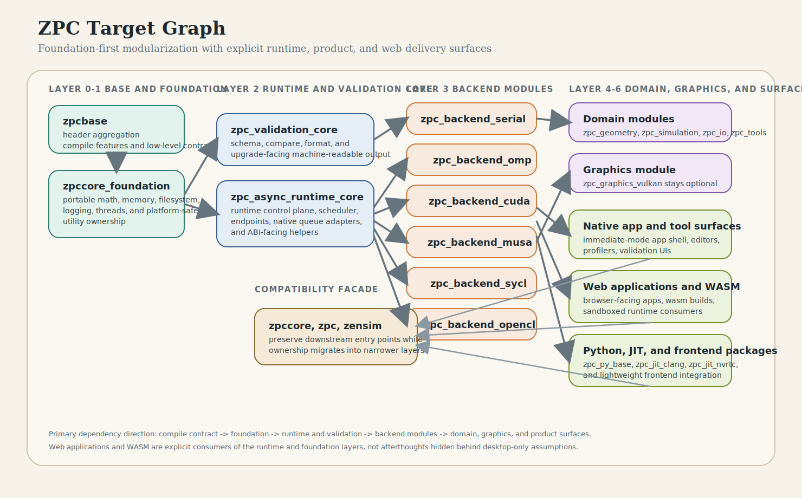
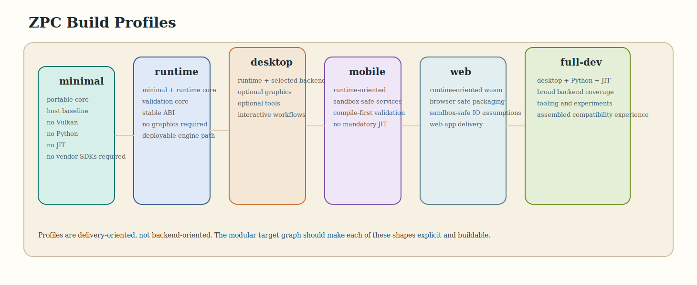

# ZPC Docs Portal

This directory is the Markdown-first home for the current ZPC architecture,
platform, and product research. It is meant to be readable in the editor, on Git
hosting UIs, and without the old generated-doc flow.

## Start Here

- [overview.md](overview.md)
  Short orientation for what ZPC is and how this docs set is organized.
- [research_topics.md](research_topics.md)
  Topic-oriented contents page with grouped subjects and suggested reading paths.
- [roadmap.md](roadmap.md)
  Strategic direction, delivery phases, and platform-surface priorities.
- [portal.html](portal.html)
  Standalone visual landing page with the same content map in HTML form.

## Read By Goal

- Understand the platform core:
  [foundation_layer.md](foundation_layer.md) ->
  [memory_backend_registry.md](memory_backend_registry.md) ->
  [runtime_core_design.md](runtime_core_design.md) ->
  [architecture_and_modularization.md](architecture_and_modularization.md)
- Understand shipping shapes and platform reach:
  [platform_and_build_profiles.md](platform_and_build_profiles.md) ->
  [implementation_roadmap.md](implementation_roadmap.md) ->
  [roadmap.md](roadmap.md)
- Understand product-facing research:
  [rendering_and_visualization.md](rendering_and_visualization.md) ->
  [physics_and_simulation.md](physics_and_simulation.md) ->
  [gameplay_and_mechanics.md](gameplay_and_mechanics.md) ->
  [application_layer_design.md](application_layer_design.md)
- Understand frontend and deployment-facing composition:
  [plugin_and_abi_stability.md](plugin_and_abi_stability.md) ->
  [lightweight_frontend_integration.md](lightweight_frontend_integration.md) ->
  [async_runtime_abi.rst](async_runtime_abi.rst)

## Topic Map

### Platform Architecture

- [foundation_layer.md](foundation_layer.md)
- [memory_backend_registry.md](memory_backend_registry.md)
- [runtime_core_design.md](runtime_core_design.md)
- [plugin_and_abi_stability.md](plugin_and_abi_stability.md)
- [architecture_and_modularization.md](architecture_and_modularization.md)
- [platform_and_build_profiles.md](platform_and_build_profiles.md)
- [implementation_roadmap.md](implementation_roadmap.md)

### Product And Application Research

- [application_layer_design.md](application_layer_design.md)
- [rendering_and_visualization.md](rendering_and_visualization.md)
- [physics_and_simulation.md](physics_and_simulation.md)
- [gameplay_and_mechanics.md](gameplay_and_mechanics.md)
- [lightweight_frontend_integration.md](lightweight_frontend_integration.md)
- [web_runtime_service_interface.md](web_runtime_service_interface.md)
- [cli_and_gui_interface_exposure.md](cli_and_gui_interface_exposure.md)
- [canary_gameplay_and_tuning.md](canary_gameplay_and_tuning.md)

### Gameplay Mechanics System

- [gameplay_mechanics_agent_prompt.md](gameplay_mechanics_agent_prompt.md)
- [gameplay_mechanics_research_roadmap.md](gameplay_mechanics_research_roadmap.md)
- [gameplay_mechanics_implementation_roadmap.md](gameplay_mechanics_implementation_roadmap.md)
- [gameplay_mechanics_benchmark_plan.md](gameplay_mechanics_benchmark_plan.md)
- [gameplay_mechanics_milestones.md](gameplay_mechanics_milestones.md)
- [gameplay_mechanics_risks_and_operating_loop.md](gameplay_mechanics_risks_and_operating_loop.md)

### Runtime And Validation References

- [async_runtime_abi.rst](async_runtime_abi.rst)
- [async_backend_profiles.rst](async_backend_profiles.rst)
- [async_native_queue_adapter.rst](async_native_queue_adapter.rst)
- [validation_schema.rst](validation_schema.rst)

## Visuals

### Target Graph

### Build Profiles

## Notes

- These architecture and roadmap notes are maintained in Markdown.
- The HTML portal is standalone and does not require the Sphinx toolchain to view.
- Remaining `.rst` pages are legacy or reference-oriented compatibility pages.
